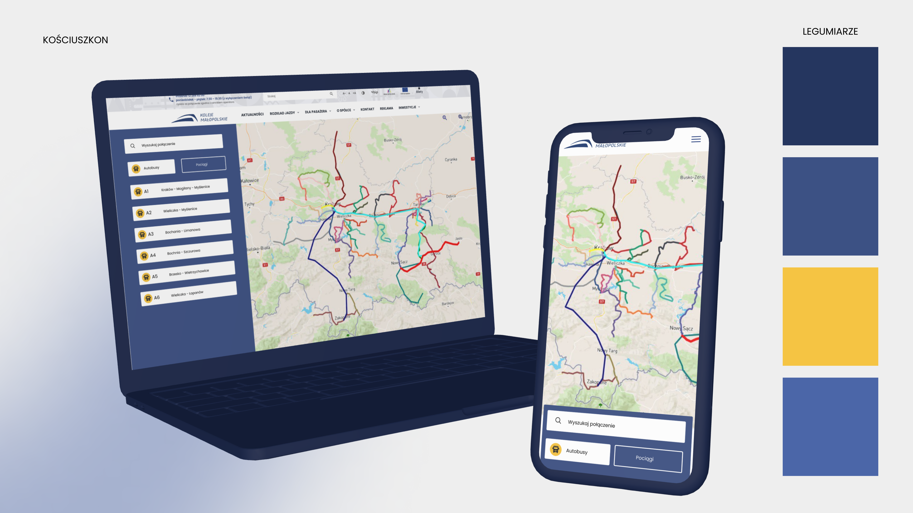
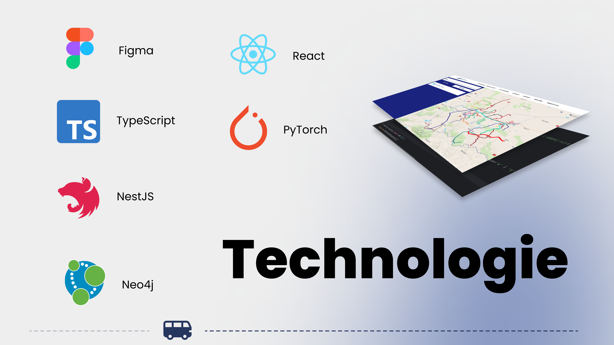
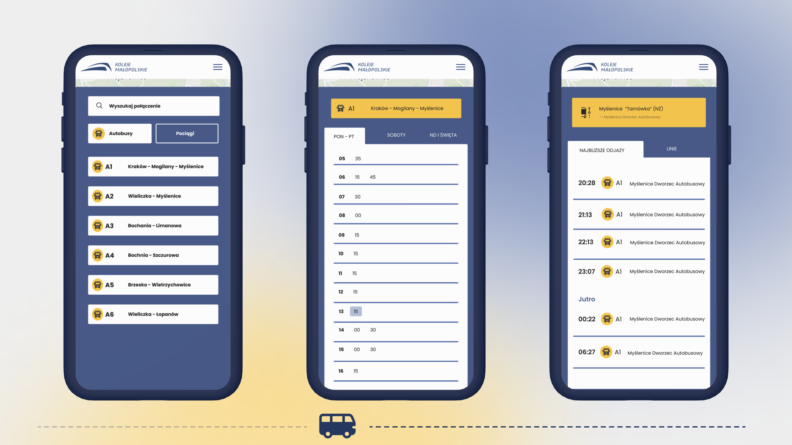
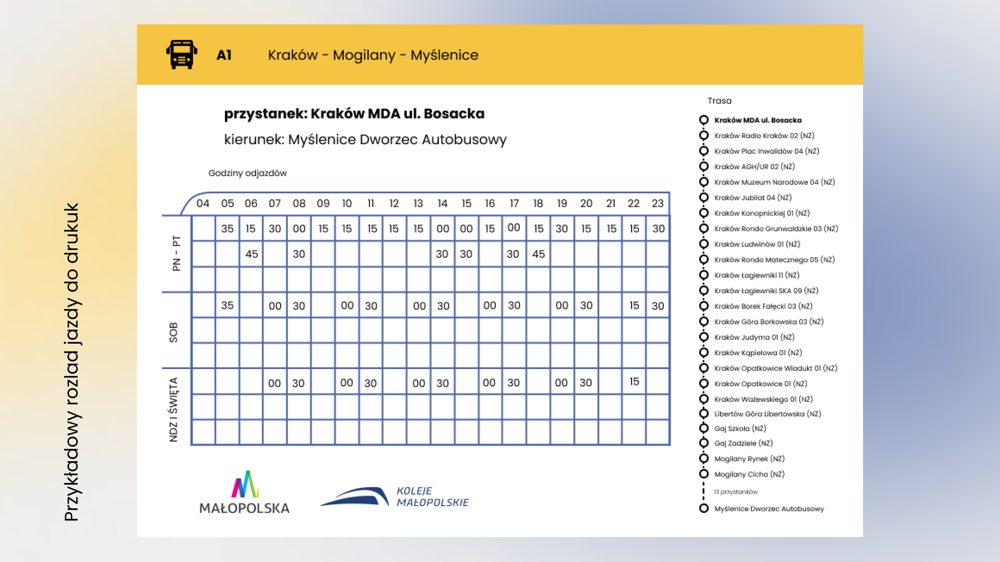

# Kościuszkon Hackathon - Koleje Małopolskie Enhanced

During the "Kościuszkon" hackathon, our team developed an innovative solution for "Koleje Małopolskie," a Polish railway company. Our project focuses on enhancing the user experience related to booking trains and buses in the Małopolskie voivodship. By leveraging modern technologies and innovative approaches, we aim to streamline the booking process, making it more user-friendly, efficient, and accessible. This solution is designed to address current challenges faced by travelers, ensuring a smoother and more enjoyable journey.

## :rocket: Innovativeness

Our solution leverages cutting-edge technologies that enable rapid development and seamless deployment. By using a stack that includes **NestJS**, **React**, **Neo4j**, and **Mapbox**, we ensure a robust and efficient application.

Neo4j is a particularly perfect match for this type of application as it excels in handling the General Transit Feed Specification (GTFS) format. This allows us to create sophisticated pathfinding algorithms and project relationships between various nodes, such as stations and routes, with ease and accuracy, far way faster then traditional databases.

Additionally, by utilizing **Docker** containers, we have streamlined our deployment process. This ensures that our solution can be deployed quickly and reliably, making it ready for immediate use. The combination of these technologies not only enhances the functionality of our application but also demonstrates our commitment to innovative problem-solving.

Our solution includes an **innovative feature** that enables the **seamless loading of GTFS** files into our Neo4j database within seconds.

## :hammer: Technical Aspect

Our choice of NestJS for the backend, React for the frontend, Neo4j for the database, and Mapbox for mapping perfectly aligns with the requirements of our application. These technologies are not only **modern** and **efficient** but also widely adapted in production by many large companies. Leveraging Docker containers ensures** smooth deployment**, while Neo4j's capabilities excel in handling GTFS data, facilitating **efficient pathfinding** and relationship management. This carefully curated tech stack ensures optimal performance and scalability, effectively meeting the demands of our transportation booking platform.

## :tada: Design (UI/UX)

Our design prioritizes accessibility and usability across all devices. Using React, we've built a mobile-ready app that seamlessly adapts to desktops, tablets, and mobile phones. This ensures users can comfortably access the platform from anywhere.

We've paid special attention to the map feature, powered by Mapbox, ensuring intuitive controls and clear navigation. This enhances user interaction and usability. Additionally, our design follows accessibility principles, making the platform easy to use for all, including those with disabilities. Overall, our goal is to provide a user-friendly experience for travelers of all backgrounds.

## :moneybag: Business Potential

Our application has significant potential for deployment by Koleje Małopolskie to address their specific needs. Given the dissatisfaction with existing solutions, our platform offers a promising alternative. Its ability to streamline the booking process and enhance user experience can greatly benefit the company and its customers. By leveraging our solution, Koleje Małopolskie can improve efficiency, customer satisfaction, and ultimately, their bottom line. With the potential to fill a gap in the market and meet the demands of both the company and its users, our application presents a valuable opportunity for real-world implementation.

Feedback from Koleje Małopolskie representatives guided our development process, ensuring their requirements were met. This collaborative approach demonstrates our commitment to delivering a solution that meets both the theme and the real-world needs of our stakeholders.

